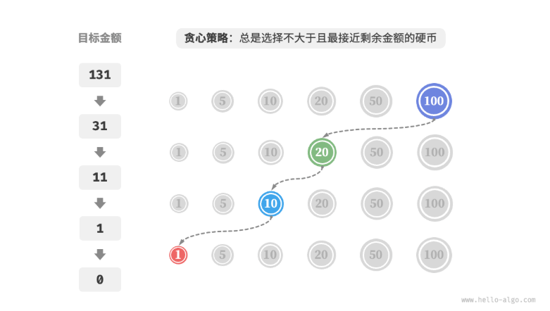

**向日葵朝着太阳转动，时刻追求自身成长的最大可能。贪心策略在一轮轮的简单选择中，逐步导向最佳答案。

[第 15 章   贪心 - Hello 算法](https://www.hello-algo.com/chapter_greedy/)
[代码随想录](https://www.programmercarl.com/%E8%B4%AA%E5%BF%83%E7%AE%97%E6%B3%95%E6%80%BB%E7%BB%93%E7%AF%87.html#%E8%B4%AA%E5%BF%83%E7%90%86%E8%AE%BA%E5%9F%BA%E7%A1%80)

---
## 简介

贪心算法（greedy algorithm）是一种常见的解决优化问题的算法，其基本思想是在问题的每个决策阶段，都选择当前看起来最优的选择，即贪心地做出局部最优的决策，以期获得全局最优解。贪心算法简洁且高效，在许多实际问题中有着广泛的应用。

贪心算法和动态规划都常用于解决优化问题。它们之间存在一些相似之处，比如都依赖最优子结构性质，但工作原理不同。

- 动态规划会根据之前阶段的所有决策来考虑当前决策，并使用过去子问题的解来构建当前子问题的解。
- 贪心算法不会考虑过去的决策，而是一路向前地进行贪心选择，不断缩小问题范围，直至问题被解决。

我们先通过例题“零钱兑换”了解贪心算法的工作原理。这道题已经在“完全背包问题”章节中介绍过，相信你对它并不陌生。

给定目标金额，**我们贪心地选择不大于且最接近它的硬币**，不断循环该步骤，直至凑出目标金额为止。

## 贪心算法的优点

### **时间复杂度低**
贪心算法通常具有较低的时间复杂度，因为它每一步只考虑局部最优解，不需要像动态规划或回溯那样保存中间状态或进行复杂的计算。例如：
- **活动选择问题**：贪心解法的时间复杂度为 \(O(n \log n)\)（排序时间），而动态规划解法需要 \(O(n^2)\)。
- **Dijkstra算法（最短路径）**：使用优先队列优化后，时间复杂度为 \(O(E + V \log V)\)，比动态规划（如Floyd-Warshall的 \(O(V^3)\)）更高效。

### ** 实现简单**
贪心算法的逻辑通常很直观，代码实现比动态规划或回溯更简单。例如：
- **找零问题**（硬币面额1,5,10,25）：直接每次选择最大可能的硬币即可。
- **霍夫曼编码**：每次合并频率最小的两个节点，直到构建完整的编码树。

### ** 空间复杂度低**
贪心算法通常只需要常数或线性空间，不需要额外的存储结构。例如：
- **Kruskal算法（最小生成树）**：使用并查集优化后，空间复杂度仅为 \(O(V)\)，而动态规划可能需要 \(O(V^2)\) 的存储。

### ** 适用于特定问题**
某些问题天然适合贪心策略，能够直接得到最优解，例如：
- **分数背包问题**（物品可分割）：按单位价值排序，贪心选择最优。
- **任务调度问题**（如Interval Scheduling）：按结束时间排序，贪心选择最早结束的任务。

---

## **. 贪心算法的局限性**
### **不保证全局最优**
贪心算法最大的问题是可能因为短视而错过全局最优解。典型例子：
- **0-1背包问题**：如果按单位价值贪心选择，可能无法得到最优解（如物品重量和价值不成比例时）。
- **硬币找零问题**：如果硬币面额不满足贪心性质（如1,3,4，要凑6），贪心解是4+1+1=3枚，但最优解是3+3=2枚。

### **依赖贪心选择性质**
贪心算法仅适用于满足以下两个条件的问题：
1. **贪心选择性质（Greedy Choice Property）**：每一步的局部最优选择能导致全局最优解。
2. **最优子结构（Optimal Substructure）**：问题的最优解包含子问题的最优解。

如果不满足这两个条件，贪心算法可能失效。例如：
- **旅行商问题（TSP）**：贪心策略（每次选择最近的未访问城市）可能陷入局部最优，而非全局最优。

### ** 难以证明正确性**
贪心算法的正确性通常需要严格的数学证明，常见方法包括：
- **交换论证（Exchange Argument）**：证明任何非贪心的解都可以调整为贪心解而不变差。
- **归纳法（Induction）**：证明贪心选择在每一步都保持最优性。

例如，**活动选择问题**的正确性可以通过“最早结束的活动必然在某个最优解中”来证明。

### **(无法回溯**
贪心算法一旦做出选择，就不会撤销或重新考虑，因此：
- **不适合需要试错的问题**（如N皇后问题、迷宫问题）。
- **无法处理有后效性的问题**（如某些动态规划问题）。

## 贪心算法特性

那么问题来了，什么样的问题适合用贪心算法求解呢？或者说，贪心算法在什么情况下可以保证找到最优解？

相较于动态规划，贪心算法的使用条件更加苛刻，其主要关注问题的两个性质。

- **贪心选择性质**：只有当局部最优选择始终可以导致全局最优解时，贪心算法才能保证得到最优解。
- **最优子结构**：原问题的最优解包含子问题的最优解。

最优子结构已经在“动态规划”章节中介绍过，这里不再赘述。值得注意的是，一些问题的最优子结构并不明显，但仍然可使用贪心算法解决。

我们主要探究贪心选择性质的判断方法。虽然它的描述看上去比较简单，**但实际上对于许多问题，证明贪心选择性质并非易事**。

例如零钱兑换问题，我们虽然能够容易地举出反例，对贪心选择性质进行证伪，但证实的难度较大。如果问：**满足什么条件的硬币组合可以使用贪心算法求解**？我们往往只能凭借直觉或举例子来给出一个模棱两可的答案，而难以给出严谨的数学证明。

## 解题步骤
那么问题来了，什么样的问题适合用贪心算法求解呢？或者说，贪心算法在什么情况下可以保证找到最优解？

相较于动态规划，贪心算法的使用条件更加苛刻，其主要关注问题的两个性质。

- **贪心选择性质**：只有当局部最优选择始终可以导致全局最优解时，贪心算法才能保证得到最优解。
- **最优子结构**：原问题的最优解包含子问题的最优解。

最优子结构已经在“动态规划”章节中介绍过，这里不再赘述。值得注意的是，一些问题的最优子结构并不明显，但仍然可使用贪心算法解决。

我们主要探究贪心选择性质的判断方法。虽然它的描述看上去比较简单，**但实际上对于许多问题，证明贪心选择性质并非易事**。

例如零钱兑换问题，我们虽然能够容易地举出反例，对贪心选择性质进行证伪，但证实的难度较大。如果问：**满足什么条件的硬币组合可以使用贪心算法求解**？我们往往只能凭借直觉或举例子来给出一个模棱两可的答案，而难以给出严谨的数学证明。

## **贪心算法的适用场景**
### **(1) 能保证最优解的问题**
- **最小生成树（Prim/Kruskal算法）**
- **最短路径（Dijkstra算法，无负权边）**
- **霍夫曼编码（数据压缩）**
- **活动选择问题（Interval Scheduling）**

### **(2) 近似算法（求近似解）**
- **集合覆盖问题（Set Cover）**：贪心算法能得到近似最优解（近似比为 \(O(\log n)\)）。
- **任务调度问题（Job Scheduling）**：贪心策略（如最长处理时间优先LPT）可以接近最优。

### **(3) 实时计算**
- **缓存替换（如LRU算法）**
- **网络路由（如贪心转发策略）**

---

## **4. 贪心算法 vs. 动态规划 vs. 回溯**
| 特性        | 贪心算法          | 动态规划          | 回溯法            |
|------------|------------------|------------------|------------------|
| **时间复杂度** | 通常较低（\(O(n \log n)\)） | 较高（\(O(n^2)\) 或更高） | 极高（指数级）     |
| **空间复杂度** | 通常 \(O(1)\) 或 \(O(n)\) | 通常 \(O(n^2)\) 或更高 | 取决于递归深度    |
| **适用问题**  | 局部最优=全局最优 | 重叠子问题+最优子结构 | 需要穷举所有可能  |
| **是否需要回溯** | 否               | 否               | 是               |
| **典型问题**  | 最小生成树、Dijkstra | 背包问题、最长公共子序列 | N皇后、数独      |

---

## **5. 如何判断是否能用贪心算法？**
1. **尝试构造反例**：看看贪心策略是否能被某个测试用例推翻。
2. **验证贪心选择性质**：是否每一步的局部最优能保证全局最优？
3. **与动态规划对比**：如果动态规划可行，但贪心更高效，则优先考虑贪心。

---

## **6. 总结**
- **优点**：高效、简单、低空间占用，适用于特定问题。
- **局限性**：不保证全局最优，适用场景有限，需要严格证明。
- **适用情况**：问题满足贪心选择性质，且最优子结构成立时优先使用。

贪心算法是算法设计中的重要策略，但必须谨慎使用，避免因局部最优而错过全局最优解。
一般情况下，贪心算法的适用情况分以下两种。

1. **可以保证找到最优解**：贪心算法在这种情况下往往是最优选择，因为它往往比回溯、动态规划更高效。
2. **可以找到近似最优解**：贪心算法在这种情况下也是可用的。对于很多复杂问题来说，寻找全局最优解非常困难，能以较高效率找到次优解也是非常不错的。
