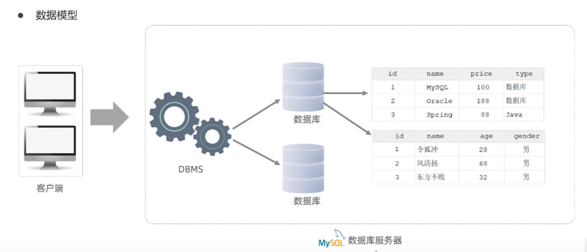

### 1、关系型数据库（RDBMS）

#### 概念

建立在关系模型基础上，由多张相互连接的二维表组成的数据库。
#### 特点

- 使用表存储结构，格式统一，便于维护
- 使用SQL语言操作，标准统一，使用方便
### 2、MySQL数据库

#### 数据模型

客户端通过SQL语句连接DBMS（数据库管理系统），来创建数据库或者在数据库里面创建表。

-  一个数据服务器当中可以创建多个数据库
- 一个数据库当中可以创建多个表
- 一个表当中可以存储多个记录

#### SQL

1、SQL通用语法及分类
##### 通用语法
1、SQL语句可以单行或者多行书写，以分号结尾

2、SQL语句可以使用空格/缩进来增强语句的可读性

3、MySQL数据库的SQL语句不区分大小写，关键字建议使用大写

4、注释：

单行注释：-- 注释内容 或 # 注释内容
多行注释：/*  */

#####  SQL分类
